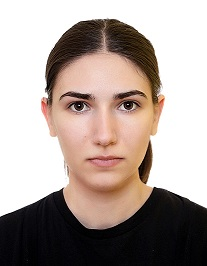

# **Umrikhina Olga**

[](%D1%84%D0%BE%D1%82%D0%BE.jpg)
## contacts:
##### telegram: [@helga_umrikh](https://t.me/helga_umrikh)
##### tel: +79500051949
##### discord: HelgaUmr#0847
---
## About me:
Lorem ipsum dolor sit amet, consectetur adipiscing elit, sed do eiusmod tempor incididunt ut labore et dolore magna aliqua. Ut enim ad minim veniam, quis nostrud exercitation ullamco laboris nisi ut aliquip ex ea commodo consequat. Duis aute irure dolor in reprehenderit in voluptate velit esse cillum dolore eu fugiat nulla pariatur. Excepteur sint occaecat cupidatat non proident, sunt in culpa qui officia deserunt mollit anim id est laborum.

---

## Skills
HTML CSS GIT

---
## Code

Here is one of my solutions in codewars:
> Complete the method/function so that it converts dash/underscore delimited words into camel casing.\The first word within the output should be capitalized only if the original word was capitalized (known as Upper Camel Case, also often referred to as Pascal case). The next words should be always capitalized.

```javascript
function toCamelCase(str){
  if (str === '') {
    return str;
  }
  


//убираем подчеркивания
let strG = str.replace(/_/g, ' ');
  strG = strG.replace(/-/g, ' ');


//разделяем строку на слова (массив)

let words = strG.split(' ');

//обрабатываем слова
let result= '';


//цикл для слов
for(let i = 0; i != words.length; i++){
  
  //обработка первого слова
  if(i === 0){
   let firstWord = words[0]
   let firstResult = firstWord[0];
   
   for(let y = 1; y < firstWord.length; y++) {
     firstResult += firstWord[y].toLowerCase();
   }
   result += firstResult;
  }
  
  //обработка остальных слов
 else {
    let worD = words[i];
    for(let x = 0; x < worD.length; x++){
      if(x === 0){
        result += worD[x].toUpperCase();
      }else {
        result += worD[x].toLowerCase();
      }
    }
 }
} 
return result;
}
```

---
## Experience

---
## Education

---
## Languages